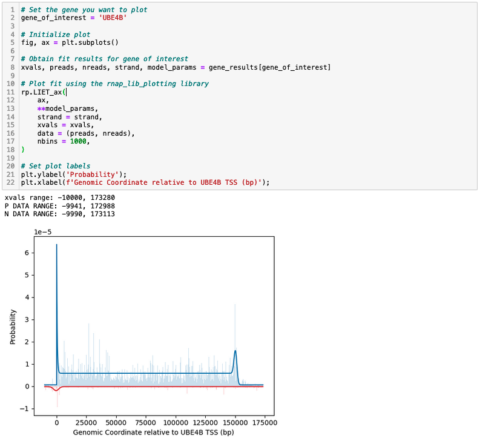

# Loading Initiation Elongation Termination (LIET) Model
## Table of contents
1. [LIET model description](#liet-model-description) - What is the LIET model and how does it work
2. [Installation](#installation) - How to install LIET
3. [Usage](#usage) - How to run LIET
4. [Example output](#example-output) - Example output of a LIET run
5. [Contact information](#contact-information) - Who to contact about LIET

<!-- -->


## LIET model description 

Transcription by RNA polymerases is an exquisitely regulated process and the principle step of the central dogma. Transcription is the primary determinant of cell-state and most cellular perturbations (e.g. disease, drug treatment, or abiotic stressors) impact transcription by altering the activity of polymerases. Thus, the ability to detect and quantify detailed changes in polymerase activity would yield considerable insight into most cellular processes. Nascent run-on sequencing assays provide a direct readout of polymerase activity, but no tools exist that comprehensively model this activity at genes.  Thus, we focus on RNA polymerase II (RNAP2), which is responsible for transcribing all protein-coding genes and many ncRNAs. Here we present the first model to fully capture the complete process of gene transcription by RNAP2.  For an individual gene, this model parameterizes each distinct stage of RNAP2 transcription&mdash;*Loading*, *Initiation*, *Elongation*, and *Termination*, hence LIET&mdash;in a biologically interpretable way, and combines them in a Bayesian mixture model intended to be applied to nascent run-on sequencing data. To learn more, read the LIET pre-print [here](https://www.biorxiv.org/content/10.1101/2024.10.03.616401v1) 

<!--  -->


__Figure 1:__ The LIET model. The distributions used to define the processes (A) Loading, Initiation (blue), and (B) Termination (orange) respectively. (C) The full LIET model with each of the separate components shown, along with the distribution of the full mixutre model (black dotted line). The Elongation region (green) is defined based on the two components that flank it (Loading+Initiation in blue; Termination in orange). The full model also includes an upstream antisense Loading+Initiation region, in red. (D) An example of the full model fit to MRPS21 from HCT116 data. Figure adapted from Figure 1 in the LIET model [preprint](https://www.biorxiv.org/content/10.1101/2024.10.03.616401v1).

The LIET model parameterizes the transcription process by annotating nascent run-on sequencing data. Below are the parameters LIET outputs on a per-gene basis from nascent run-on sequencing data: 

| Parameter       | LIET Output Value                | Units                 | Description                                              |
|-----------------|----------------------------------|-----------------------|----------------------------------------------------------|
| $\mu_L$         | `mL`                                 |          Positions (base pairs)             | Polymerase loading position                              |
| $\mu_L'$        |       `mL_a`                             |        Positions (base pairs)                 | Polymerase antisense loading position                    |
| $\sigma_L$      |        `sL`                          |            Lengths (base pairs)             | Polymerase loading uncertainty                           |
| $\sigma_L'$     |           `sL_a`                       |         Lengths (base pairs)              | Polymerase antisense loading uncertainty                 |
| $T_{I}$         |                `tI`                  |           Lengths (base pairs)            | Polymerase initiation length                             |
| $T_{I}'$        |             `tI_a`                     |           Lengths (base pairs)            | Polymerase antisense initiation length                   |
| $\mu_T$         |                  `mT`                |          Positions (base pairs)              | Polymerase dissociation position                         |
| $\sigma_T$      |                     `sT`             |             Lengths (base pairs)           | Polymerase dissociation uncertainty                      |
| $W_{LI}$        |                   First value in `w` list               |       Weights (fraction %)                | Proportion of reads that fall into loading and initiation|
| $W_{E}$         |          Second value in `w` list                         |         Weights (fraction %)               | Proportion of reads that fall into elongation            |
| $W_{T}$         |              Third value in `w` list                     |           Weights (fraction %)             | Proportion of reads that fall into termination           |
| $W_{B}$         |                  Fourth value in `w` list                 |            Weights (fraction %)            | Proportion of reads that fall into background signal     |
| $W_{B}'$        |             Second value in `w_a` list                      |           Weights (fraction %)             | Proportion of reads that fall into antisense background signal |
| $W_{LI}'$       |                   First value in `w_a` list                |          Weights (fraction %)              | Proportion of reads that fall into antisense loading and initiation |

## Installation 
1. To install LIET, first set up Miniconda on the cluster you are running LIET on. Instructions on how to do this are on the anaconda website [here](https://docs.anaconda.com/miniconda/). Once you are on the website, scroll to the "quick command line install" and run the appropriate command based on your operating system (eg: macOS, Linux, or Windows). 

2. After you have installed Miniconda, install the PyMC (version 5.6) package into a new conda environment. 
```
conda create -c conda-forge -n your_env_name "pymc==5"
conda activate your_env_name
```
*Note, do not specifiy the last digit of PyMC version 5.6 (eg: do not write `pymc==5.6` in the command above)*

3. Check the version of PyMC you have installed by running the command below. You should have installed PyMC version 5.6.
```
conda list
```

4. When you run LIET, make sure to activate the PyMC environment you have just created using the following command:
```
conda activate your_env_name
```

5. Once PyMC is installed, clone the LIET GitHub repository. 

## Usage 

### Running LIET

The software can be run in a number of ways, but we generally recommend using a HPC system with a workload manager like SLURM. The `./liet/liet_exe_mp.py` script is the main executable for fitting LIET to batches of genes. Within your job submission script you run the script as follows:
```
$ python /path/to/file/liet_exe_mp.py --config /path/to/config_file
```
The config file contains references to all inputs required to run the fitting, the details of which are outlined below. The `liet_exe_mp.py` script must be in the same directory as the other LIET library files as it imports from them.

LIET batches can also be run on non-HPC systems both in batches and on a gene-by-gene basis. Though we do not recommend the former (fitting is slow) it can be done using the non-paralellized version of the batch script (`liet_exe.py`) in the same fashion. Running LIET on individual genes can be done within a Jupyter notebook (see `LIET_fitting_example.ipynb`). No matter how you run LIET, the inputs are all specified within the config file.

### Config file
LIET takes one config file per sample run, which points the software to where the annotation file (what genes you want LIET to annotate), bedgraph files (input data), pad file (how many extra bases you want to add to the 5' and 3' ends of the gene annotation supplied in the annotation file to ensure LIET captures the entire transcription process), and path to where you want your results located/your result file name. 

An example configuration file is shown below (*Note example priors are set in the configuration file below, however these should be tailored to your gene set and data LIET is being run on*). The `[MODEL]`, `[DATA_PROC]`, `[FIT]`, and `[RESULTS]` sections of the config file do not need to change for basic LIET usage on nascent run-on sequencing data.
```
[FILES]
ANNOTATION=/path-to-your-annotation-file/
BEDGRAPH_POS=/path-to-your-positive-bedgraph-file/
BEDGRAPH_NEG=/path-to-your-negative-bedgraph-file/
RESULTS=/path-to-your-results-directory/result-file-name.liet
PAD_FILE=/path-to-your-pad-file/

[MODEL]
ANTISENSE=True
BACKGROUND=True
FRACPRIORS=False

# Example [PRIORS] below. 
# These priors are a good starting place for running LIET.
# Reccomendation: play with changing prior values & look at associated LIET fits.
# This will help you determine which values are the best for your genes/data. 
# More information about priors can be found on PyMC's website.
[PRIORS]
mL=dist:normal,mu:0,sigma:1500
sL=dist:exponential,offset:1,tau:500
tI=dist:exponential,offset:1,tau:500
mT=dist:exponential,offset:1,tau:10000
sT=dist:exponential,offset:10,tau:500
w=dist:dirichlet,alpha_LI:1,alpha_E:1,alpha_T:1,alpha_B:1
mL_a=dist:normal,mu:0,sigma:1500
sL_a=dist:exponential,offset:1,tau:500
tI_a=dist:exponential,offset:1,tau:500

[DATA_PROC]
RANGE_SHIFT=True
PAD=10000,30000

[FIT]
ITERATIONS=50000
LEARNING_RATE=0.05
METHOD=advi
OPTIMIZER=adamax
MEANFIELD=True
TOLERANCE=1e-5

[RESULTS]
SAMPLES=50000
MEAN=True
MODE=False
MEDIAN=False
STDEV=True
SKEW=False
PDF=False
```
### Annotation file
The `ANNOTATION` file (specified in the config file) is a tab separated/headerless file that contans the set of genes you want to run LIET on. The format for the annotation file is `chromosome start stop gene length-of-gene strand`

Example annotation file: 
```
chr1	6185019	6199595	RPL22	14576	-
chr1	8860999	8878686	ENO	17687	-
chr1	10032957	10181239	UBE4B	148282	+
chr1	11054588	11060018	SRM	-
chr1	15409887	15430339	EFHD2	20452	+
chr1	15617457	15669044	DDI2	51587	+
chr1	17018751	17054032	SDHB	35281	-
chr1	19882394	19912945	OTUD3	30551	+
chr1	20499447	20508151	MUL1	8704	-
chr1	21440136	21484900	NBPF3	44764	+

```
### Bedgraph files
`BEDGRAPH_POS` & `BEDGRAPH_NEG` (specified in the config file) are the input data for LIET. These files should be strand separated bedgraph files. Because the LIET model assumes each read is a direct measure of polymerase activity it is important that the bedgraph files **only** contain the 3-prime-most position of ech nascent read. Therefore, each read fed into LIET should only be one base long. If you supply the LIET model with entire reads, the software will take **significantly** longer. 

### Pad file
The `PAD_FILE` (specified in the config file) is a tab separated/headerless file that contains the padding regions you want to add on to your annotated genes. This feature gives LIET more space to search for each parameter, given transcription begins before the annotated transcription start site and ends after the RNA cleavage site. The format for the annotation file is `gene 5’pad,3’pad`.

Example pad file: 
```
RPL22	5000, 25000
ENO1	10000, 30000
UBE4B	10000, 25000
SRM	3500, 7000
EFHD2	10000, 25000
DDI2	9000, 11000
SDHB	9000, 6000
OTUD3	3000, 30000
MUL1	10000, 9000
NBPF3	7500, 16000
```
It is important to note that **a pad file is not necessary to run LIET**. A defult pad is supplied in the `[DATA_PROC]` section of the config file. The following `[DATA_PROC]` example  would set default pads of 10,000 bases added onto the 5' end and 30,000 bases onto the 3' end at every gene if no pad file was provided. 

```
[DATA_PROC]
RANGE_SHIFT=True
PAD=10000,30000
```
## Example output
After LIET successfully runs, it will output 3 files: `your_output_name.liet`, `your_output_name.liet.log`, and  `your_output_name.liet.err`

### `your_output_name.liet` file description 
The `your_output_name.liet` file contains the model output in the format of `param=value;stdev-of-value` for `mL` ($\mu_L$), `sL` ($\sigma_L$), `mL_a` ($\mu_L'$), `sL_a` ($\sigma_L'$), `tI` ($T_{I}$), `tI_a` ($T_{I}'$),`mT` ($\mu_T$), and `sT` ($\sigma_T$). 

This file also contains the relative proportions of each read in each stage of transcription ("weights") that are also in the format of `param=value;stdev-of-value`. Specifically, weights for each parameter appear as `w=[W_LI, W_E, W_T, W_B]` ($W_{LI}$, $W_{E}$, $W_{T}$, $W_{B}$) for the sense strand, and `w_a=[W_LI', W_B']` ($W_{LI}'$, $W_{B}'$) for the antisense strand in the LIET output file. This file also contains the annotation information associated with each gene that was properly fit, eg: `chr start stop strand gene`.

*Note all output parameters are reported in units of bases relative to the input annotation `start` position*

Example `your_output_name.liet` file: 

```
# < date & time >
# CONFIG	< config file >
# Output format: param_name=value:stdev
#===============================================================================
chr1	6192929	6199595	-1	RPL22	mL=-7.37:1.97,sL=29.45:1.48,tI=941.68:16.17,mT=15346.39:7.23,sT=1141.38:5.97,w=[0.11 0.4  0.37 0.12]:[0. 0. 0. 0.],mL_a=79.13:6.39,sL_a=47.32:7.2,tI_a=412.33:18.51,w_a=[0.54 0.46]:[0.01 0.01]
chr1	8862886	8878686	-1	ENO1	mL=28.6:0.17,sL=6.83:0.16,tI=31.86:0.48,mT=20057.07:9.87,sT=1625.24:8.52,w=[0.04 0.78 0.14 0.04]:[0. 0. 0. 0.],mL_a=-55.47:6.28,sL_a=388.95:7.05,tI_a=1493.6:14.77,w_a=[0.9 0.1]:[0. 0.]
chr1	10032957	10179562	1	UBE4B	mL=32.71:0.81,sL=4.49:0.67,tI=440.27:11.48,mT=150245.41:19.92,sT=1200.96:19.44,w=[0.03 0.82 0.04 0.11]:[0. 0. 0. 0.],mL_a=-15.62:31.39,sL_a=2130.23:68.76,tI_a=467.92:102.13,w_a=[0.21 0.79]:[0.01 0.01]

```

### `your_output_name.liet.log` description 
The `your_output_name.liet.log` file contains ancillary information for each gene from each fit. This file contains the range of bases (referenced from the input annotation `start` position the model used to fit each gene (`fit_range`), the coverage on each strand (`strand_cov`), the minimum residual value and residual value in the first iteration of fitting (`elbo_range`), the number of iterations LIET fit the data (`iterations`), and how long the model took to fit each gene in units of minutes (`fit_time_min`). 

Example `your_output_name.liet.log` file:
 
```
# < date & time >
# CONFIG < config file >
#===============================================================================
>RPL22:chr1:6192929:6199595:-1
fit_range:(-4999, 39576)
strand_cov:(1424, -97157)
elbo_range:(978308.6131516759, 1304787.3519572061)
iterations:50000

```

### `your_output_name.liet.err` description 
The `your_output_name.liet.log` file contains information about any errors that occured when fitting each gene. If no errors occured, the file will just write the name of the gene that was fit to this file. 

Example `your_output_name.liet.err` file where genes were fit with no errors: 
```
>RPL22
>ENO1
>UBE4B
```

### Plotting your fits
After running LIET, **assessment of the output fits are essential** to ensure the model worked as anticipated. The `liet_res_class.py`, `rnap_lib_fitting_results.py` and `rnap_lib_plotting.py` libraries are helpful for plotting model fits. 

Example workflow for plotting fits: 
1. Import necessary packages 


2. Define LIET output files and pull out model fits for specified genes


3. Plot LIET fit





## Contact information
Contact jacob.stanley@colorado.edu or georgia.barone@colorado.edu for more information. 


